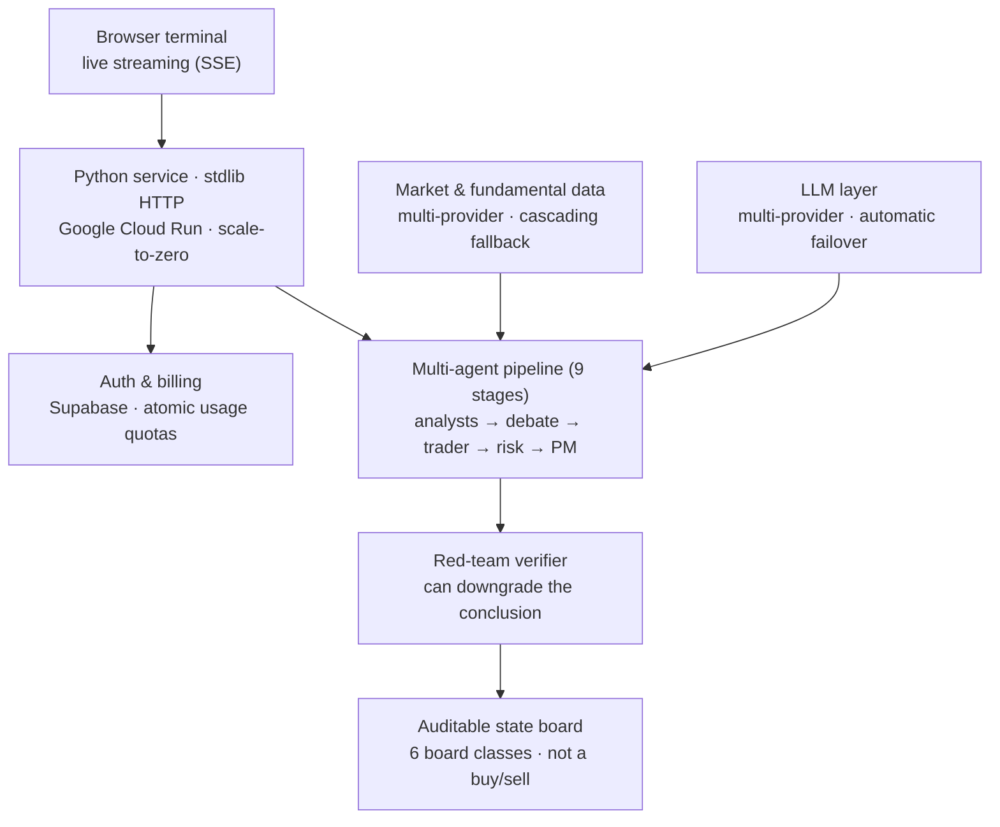

# Flowdex Desk

**An AI research terminal for global markets — live in production at [desk.flowdex.com.ar](https://desk.flowdex.com.ar).**

Flowdex Desk runs a multi-agent analysis pipeline over any of **541 curated assets** (plus any US-listed ticker on demand) and streams the reasoning to the browser as it happens. Built in Python on the standard library, serving its own zero-build vanilla-JS frontend, deployed on Google Cloud Run with scale-to-zero economics.

> **This is a conceptual overview, not a code repository.** Flowdex Desk is a private, commercial product; this page shows the system at the topology level. Source code, prompts, scoring logic and provider details are intentionally omitted.

**Stack:** Python 3.10+ · multi-provider LLMs with cascading fallback · Supabase (auth, credits, shared cache, pgvector) · Docker · Google Cloud Run · vanilla-JS frontend (no build step, no framework)

---

## The product decision that defines it

The output is **not** a buy/sell signal. Each analysis produces an **auditable state board** — three structural axes, a 0–5 strength score, and five color-coded lenses — routed to one of **six board classes** depending on what the asset *is* (company, index, fixed income, commodity, FX, crypto). A bond is not read like a meme stock.

No black box, no fabricated urgency, no promised returns. When the data isn't there, the board says **N-D** (no data) rather than guessing — honest degradation is a hard rule enforced in code, not a disclaimer.

## Architecture (conceptual)

The pipeline runs nine stages — data seeding, news, seven specialist analysts, a bull-vs-bear debate, a trader plan, a three-persona risk committee, a portfolio manager that produces the board, and a **red-team verifier** that checks every cited figure against the real data and has the authority to *lower* the final strength score. Deterministic gates sit between the language models and the conclusion at every point that matters.

## Engineering highlights

**LLMs on a leash.** Specialized agents stream their reasoning over Server-Sent Events, but they don't get the last word: deterministic liquidity/FX gates, a self-consistency ensemble that runs the portfolio manager multiple times and votes, and a verifier that cross-checks cited prices and ratios against actual data. A hallucinated number gets caught before it reaches the user.

**A defensive data layer.** Price, fundamentals, news and macro data come from multiple independent providers with cascading fallback, stale-if-error caching, and per-seed isolation — one source failing degrades a single lens to N-D instead of aborting the run. If there's no price series at all, the analysis refuses to start and **refunds the credit**.

**Quantitative engines with zero AI.** Alongside the agent pipeline: DCF valuation with WACC×g sensitivity matrices, multi-model price projection (GBM, GARCH, mean-reversion, jump-diffusion — 10k reproducible paths), option-implied probabilities via Breeden-Litzenberger, factor/beta decomposition, and a full portfolio module (FIFO accounting, VaR/CVaR, 15 research-cited behavioral-bias detectors, historical stress tests, Monte Carlo goal planning). Pure math, deterministic, fully unit-tested.

**Production hardening.** JWT auth with single-use SSE tickets (the token never rides in a URL), **race-free atomic usage quotas** (advisory locks + idempotency windows — no double-billing across instances), fail-closed endpoint protection, bot defenses (rate limiting, honeypots with escalation, AI-crawler blocking), and health alerting. A three-level cache (memory → disk → cross-instance) means a popular ticker is analyzed **once for everyone**.

**Cheap by construction.** The HTTP layer is the Python standard library — no web framework to carry, pin or migrate. The frontend is vanilla JS with no build step. The service scales to zero when idle and multi-provider failover keeps LLM costs both low and resilient. **243 automated tests** run without any network access, including a golden-set that pins the analysis invariants across all six board classes.

## By the numbers

| | |
|---|---|
| Asset universe | **541 curated assets** — US & global equities, Argentine ADRs/CEDEARs/bonds, Brazil B3, Hong Kong & China A-shares, indices, futures, FX, crypto — plus any US-listed ticker resolved on the fly |
| Markets | 🇺🇸 US · 🇦🇷 Argentina · 🇧🇷 Brazil · 🇭🇰🇨🇳 China · global FX & crypto |
| Pipeline | 9 stages, 7 specialist analysts, adversarial debate, risk committee, red-team verification |
| Views | 17 live views — most of them deterministic and free of AI quota |
| Tests | 243 passing, fully offline (deterministic mock LLM) |

## Notes

The terminal is a research and education tool. It does not place orders and does not provide financial advice.

*Built and operated by [@frannkurt](https://github.com/frannkurt) — part of the [Flowdex](https://flowdex.com.ar) platform.*
