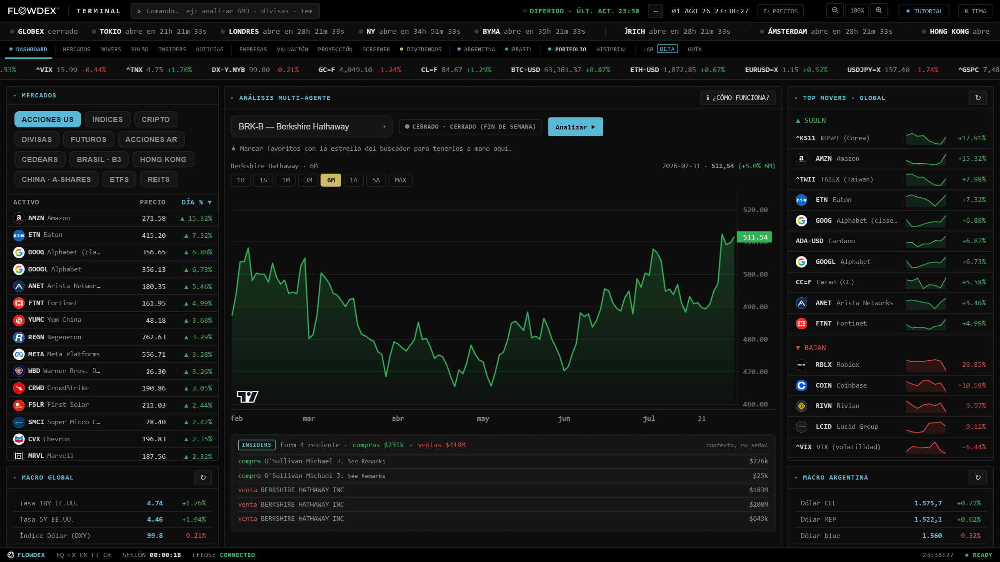
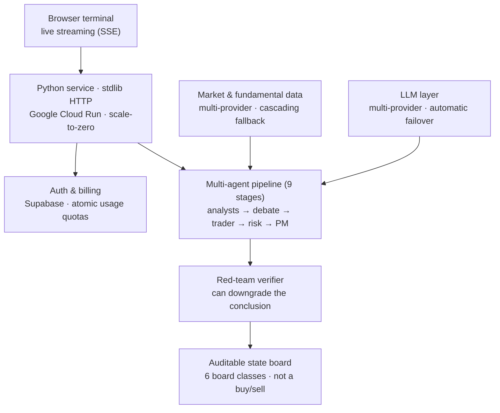
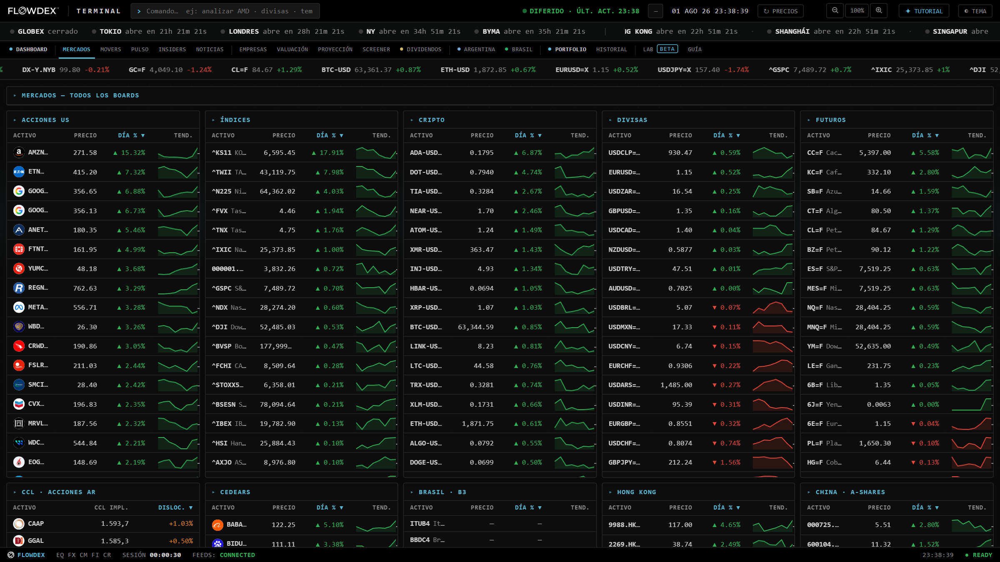
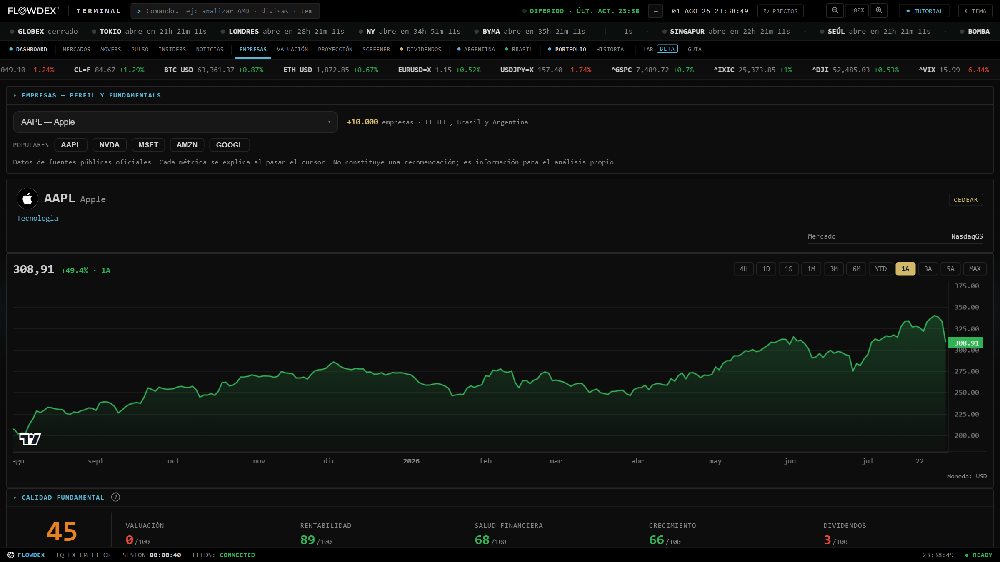
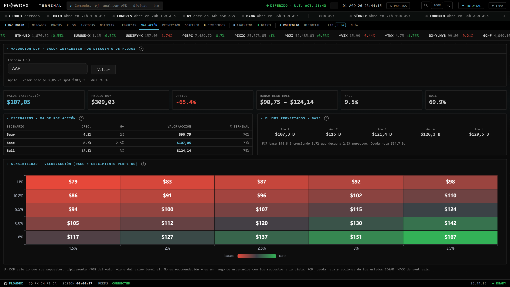
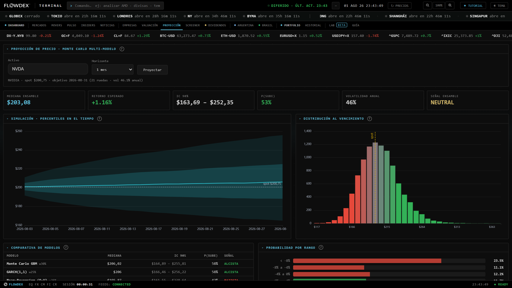
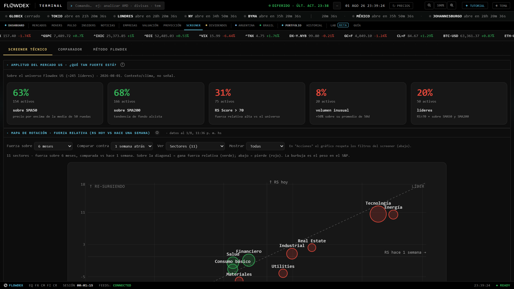
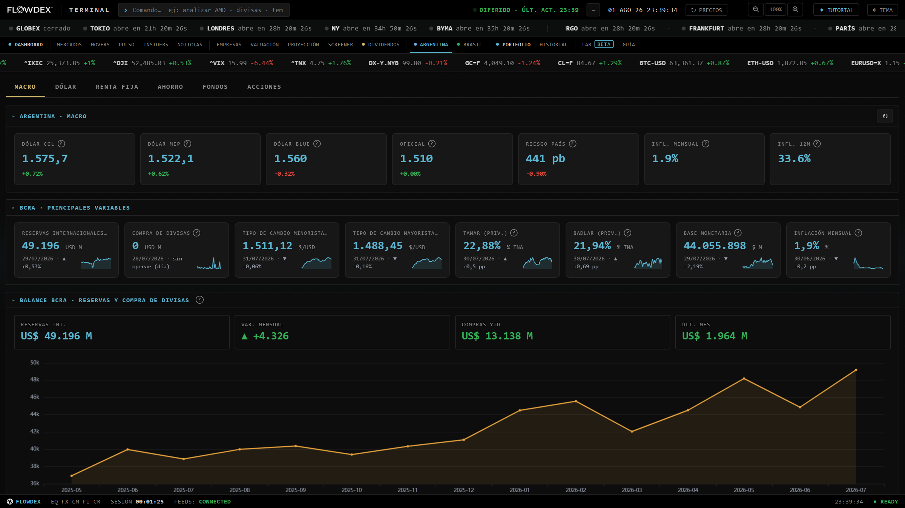
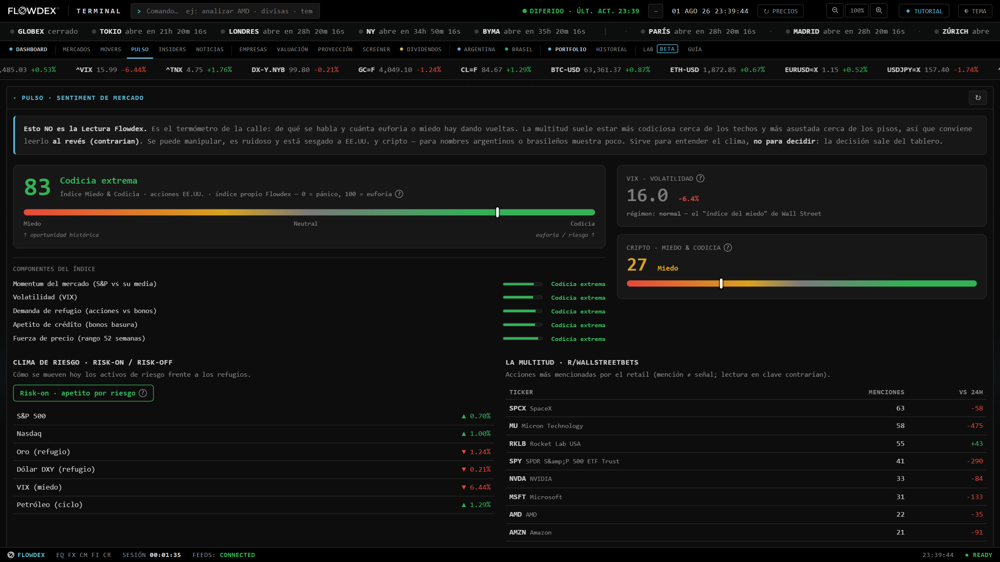
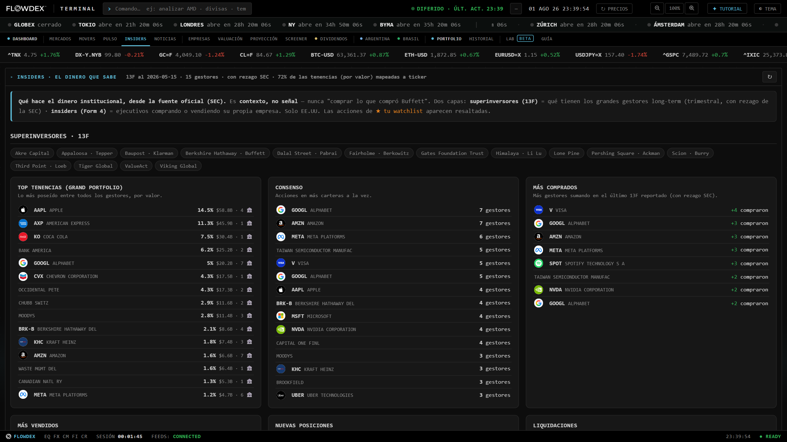

# Flowdex Desk

**An AI research terminal for global markets — live in production at [desk.flowdex.com.ar](https://desk.flowdex.com.ar).**

Flowdex Desk runs a multi-agent analysis pipeline over any of **541 curated assets** (plus any US-listed ticker on demand) and streams the reasoning to the browser as it happens. Built in Python on the standard library, serving its own zero-build vanilla-JS frontend, deployed on Google Cloud Run with scale-to-zero economics.

> **This is a conceptual overview, not a code repository.** Flowdex Desk is a private, commercial product; this page shows the system at the topology level. Source code, prompts, scoring logic and provider details are intentionally omitted.

**Stack:** Python 3.10+ · multi-provider LLMs with cascading fallback · Supabase (auth, credits, shared cache, pgvector) · Docker · Google Cloud Run · vanilla-JS frontend (no build step, no framework)

---

## The product decision that defines it

The output is **not** a buy/sell signal. Each analysis produces an **auditable state board** — three structural axes, a 0–5 strength score, and five color-coded lenses — routed to one of **six board classes** depending on what the asset *is* (company, index, fixed income, commodity, FX, crypto). A bond is not read like a meme stock.

No black box, no fabricated urgency, no promised returns. When the data isn't there, the board says **N-D** (no data) rather than guessing — honest degradation is a hard rule enforced in code, not a disclaimer.

## Architecture (conceptual)

The pipeline runs nine stages — data seeding, news, seven specialist analysts, a bull-vs-bear debate, a trader plan, a three-persona risk committee, a portfolio manager that produces the board, and a **red-team verifier** that checks every cited figure against the real data and has the authority to *lower* the final strength score. Deterministic gates sit between the language models and the conclusion at every point that matters.

---

## A tour of the terminal

### Markets — every board, one screen

US equities, indices, crypto, FX, futures, Argentine ADRs with implied CCL dislocation, CEDEARs, Brazil B3, Hong Kong and China A-shares — live boards with sparklines, market-session clocks for a dozen exchanges, and a global ticker tape.

### Companies — fundamentals without burning a credit

Profile, fundamental-quality scores (valuation / profitability / financial health / growth / dividends), ratios and full statements for **10,000+ companies** across the US, Brazil and Argentina — straight from official primary sources (SEC EDGAR and exchange data), no AI involved, free to browse.

### DCF Valuation — intrinsic value with the assumptions on the table

Discounted cash flow on EDGAR fundamentals with a self-computed WACC (country-adjusted CAPM), bear/base/bull scenarios, and a WACC × perpetual-growth **sensitivity heatmap**. The disclaimer is part of the design: a DCF is worth exactly what its assumptions are, so they're all visible.

### Price Projection — four stochastic models, one ensemble

Monte Carlo with **10,000 reproducible paths** per run: GBM, GARCH(1,1), mean-reverting Ornstein-Uhlenbeck and jump-diffusion, blended into a weighted ensemble. Percentile fan chart, terminal distribution, probability by range, model-by-model comparison — plus option-implied probabilities (Breeden-Litzenberger) and factor/beta decomposition on US names.

### Technical Screener — breadth, rotation and relative strength

Market-breadth gauges over the US leader universe, a **sector rotation map** (relative strength today vs. a week ago, bubble-sized by S&P weight) with independent lookback knobs, a Minervini-style trend-template screener, and an A/B comparator against SPY.

### Argentina — the hard market, taken seriously

CCL/MEP/blue/official FX rates, country risk, inflation, the full BCRA variables panel with its balance-sheet series, sovereign bond curves (hard-dollar and CER), LECAP yields, mutual funds by AUM, savings-rate comparisons, and fixed-term/bond calculators — all from official and primary sources.

### Pulse — sentiment, read the right way

A proprietary Fear & Greed index for US equities with its five components exposed, crypto F&G, VIX regime, a risk-on/risk-off climate board and the retail chatter from r/wallstreetbets — framed explicitly as *contrarian context, not signal*. The UI itself tells you not to trade on it.

### Insiders — what the money that knows is doing

Superinvestor 13F tracking (Buffett, Ackman, Burry, Li Lu, Klarman and more): grand-portfolio top holdings, cross-manager consensus, biggest new buys and liquidations — plus corporate **Form 4** insider transactions, straight from the SEC with the reporting lag stated on screen.

### And the rest

- **Portfolio** (hosted) — multi-broker tracking with FIFO accounting, daily revaluation, CSV/XLSX import, tail-risk metrics (VaR/CVaR/Ulcer), **15 research-cited behavioral-bias detectors**, historical stress tests (2008 / COVID / 2022), diversification analytics (effective bets, correlation heatmap), what-if simulator, model-portfolio benchmarks and Monte Carlo goal planning. Deterministic — zero AI.
- **Dividend Radar** — a dedicated multi-agent read on dividend sustainability, gated as a paid pass.
- **Brazil** — B3 market, dividends and fixed income (Selic/CDI/IPCA) with a CDI calculator and FX converter.
- **News** — asset and macro headlines from primary sources (Fed, Treasury, exchanges), localized by country.
- **Lab** — a backtesting sandbox: 8 strategies, multi-asset portfolios, CEDEAR/ADR ratio audits.
- **Guide** — built-in product school: 35 glossary terms with educational popovers, annotated mockups, FAQ.
- **UX** — command bar, watchlist, asset comparator, PDF export, ARS/USD toggle, guided spotlight onboarding, responsive nav, dark/light themes.

---

## Engineering highlights

**LLMs on a leash.** Specialized agents stream their reasoning over Server-Sent Events, but they don't get the last word: deterministic liquidity/FX gates, a self-consistency ensemble that runs the portfolio manager multiple times and votes, and a verifier that cross-checks cited prices and ratios against actual data. A hallucinated number gets caught before it reaches the user.

**A defensive data layer.** Price, fundamentals, news and macro data come from multiple independent providers with cascading fallback, stale-if-error caching, and per-seed isolation — one source failing degrades a single lens to N-D instead of aborting the run. If there's no price series at all, the analysis refuses to start and **refunds the credit**.

**Quantitative engines with zero AI.** Everything in the Valuation, Projection, Screener and Portfolio views above is pure math — deterministic, reproducible, fully unit-tested, and free of AI quota.

**Production hardening.** JWT auth with single-use SSE tickets (the token never rides in a URL), **race-free atomic usage quotas** (advisory locks + idempotency windows — no double-billing across instances), fail-closed endpoint protection, bot defenses (rate limiting, honeypots with escalation, AI-crawler blocking), and health alerting. A three-level cache (memory → disk → cross-instance) means a popular ticker is analyzed **once for everyone**.

**Cheap by construction.** The HTTP layer is the Python standard library — no web framework to carry, pin or migrate. The frontend is vanilla JS with no build step. The service scales to zero when idle and multi-provider failover keeps LLM costs both low and resilient. **243 automated tests** run without any network access, including a golden-set that pins the analysis invariants across all six board classes.

## By the numbers

| | |
|---|---|
| Asset universe | **541 curated assets** — US & global equities, Argentine ADRs/CEDEARs/bonds, Brazil B3, Hong Kong & China A-shares, indices, futures, FX, crypto — plus any US-listed ticker resolved on the fly |
| Markets | 🇺🇸 US · 🇦🇷 Argentina · 🇧🇷 Brazil · 🇭🇰🇨🇳 China · global FX & crypto |
| Pipeline | 9 stages, 7 specialist analysts, adversarial debate, risk committee, red-team verification |
| Views | 17 live views — most of them deterministic and free of AI quota |
| Tests | 243 passing, fully offline (deterministic mock LLM) |

## Notes

The terminal is a research and education tool. It does not place orders and does not provide financial advice. Screenshots show the live product with deferred market data.

*Built and operated by [@frannkurt](https://github.com/frannkurt) — part of the [Flowdex](https://flowdex.com.ar) platform.*
