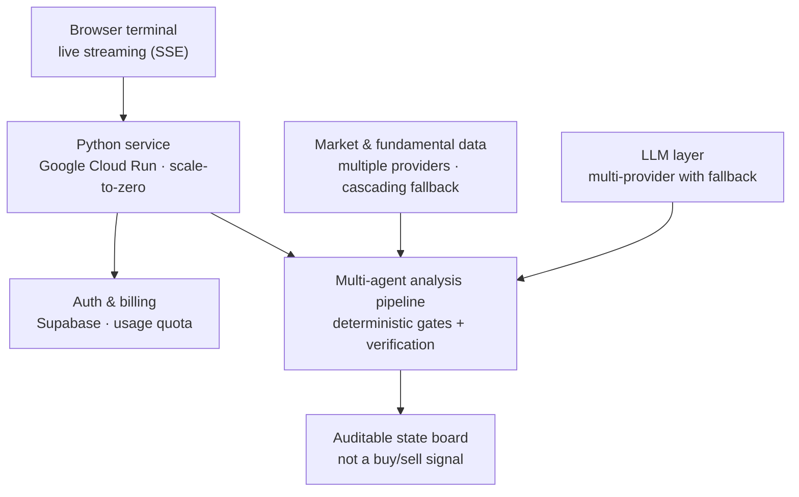

# Flowdex Desk

Flowdex Desk is an **AI research terminal** for equity, fixed-income, FX and crypto analysis — built in Python and running in production on Google Cloud Run. It runs a multi-agent analysis over a requested asset and streams the result to the browser live.

> **This is a conceptual overview, not a code repository.** Flowdex Desk is a private, commercial product; the diagram below shows the system at the topology level only, and implementation details are intentionally omitted.
>
> **Live product:** [desk.flowdex.com.ar](https://desk.flowdex.com.ar)

**Stack:** Python 3.10+ · multi-provider LLMs (Gemini + OpenAI-compatible fallback) · Supabase (auth & billing) · Docker · Google Cloud Run · vanilla-JS frontend (no build step)

---

## What it is

A browser-based terminal that runs a multi-agent analysis over an asset and streams the reasoning as it happens. Its defining product decision is what it **refuses** to be: the output is **not** a buy/sell signal. It's an **auditable state board** — a transparent read across business, valuation and risk, with an explicit strength score and the reasoning behind it. No black box, no fabricated urgency, no promised returns. When the data isn't there, it says so rather than guessing.

## Architecture (conceptual)

## Engineering highlights

The interesting parts are *how* it stays trustworthy and cheap to run, not the proprietary scoring itself:

**A multi-agent pipeline with guardrails.** Specialized agents analyze the asset and stream their progress to the browser over Server-Sent Events. **Deterministic gates** sit between the language models and the conclusion, bounding what they're allowed to assert — the system isn't hostage to a model's hallucination at the points that matter.

**A defensive data layer.** Market and fundamental data come from multiple providers with **cascading fallback** and multi-level caching, so a single source failing degrades gracefully instead of aborting the analysis.

**Production hardening.** JWT auth, **atomic (race-free) usage quotas**, fail-closed endpoint protection, and a Dockerized service on Cloud Run that scales to zero when idle — real per-request cost control.

**Zero deployment lock-in.** The HTTP layer is built on the Python standard library — no web framework dependency to carry, pin or migrate.

## Notes

The terminal is a research and education tool. It does not place orders and does not provide financial advice. Source code, prompts, scoring logic and data-provider details are private; this page is a high-level overview only.
