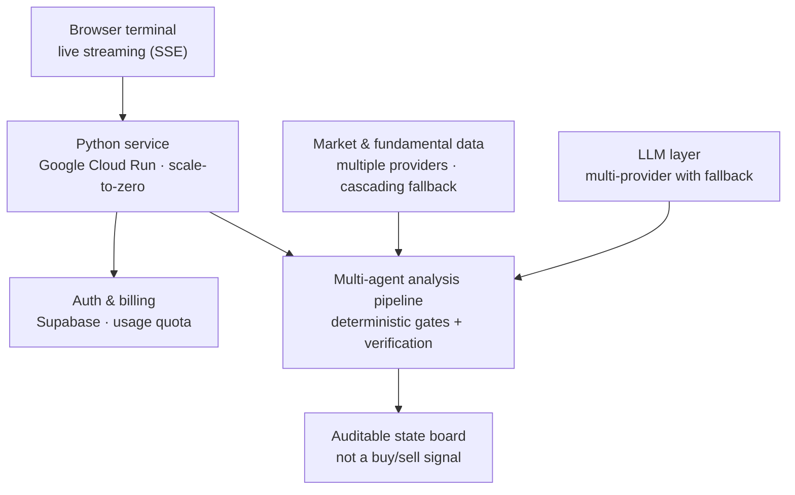

# Flowdex Desk

An AI research terminal for equity, fixed-income, FX and crypto analysis — built in Python and running in production on Google Cloud Run.

> **This is a conceptual overview, not a code repository.** Flowdex Desk is a private, commercial product. The diagram below shows the system at the topology level only; implementation details are intentionally omitted.
>
> **Live product:** [desk.flowdex.com.ar](https://desk.flowdex.com.ar)

**Stack:** Python 3.10+ · multi-provider LLMs (Gemini + OpenAI-compatible fallback) · Supabase (auth & billing) · Docker · Google Cloud Run · vanilla JS frontend (no build step)

---

## What it is

A browser-based terminal that runs a multi-agent analysis over a requested asset and streams the result live. Its defining product decision: the output is **not** a buy/sell signal. It's an **auditable state board** — a transparent read across business, valuation and risk, with an explicit strength score and the reasoning behind it. No black box, no fabricated urgency, no promised returns.

## Architecture (conceptual)

## Engineering highlights (without the recipe)
- **Multi-agent pipeline in production**, streamed live to the browser, with deterministic gates that bound what the language models are allowed to conclude.
- **Defensive data layer:** multiple providers with cascading fallback and multi-level caching, so partial source failures degrade gracefully.
- **Production hardening:** JWT auth, atomic (race-free) usage quotas, fail-closed endpoint protection, Dockerized on Cloud Run with scale-to-zero.
- **Zero deployment lock-in:** the HTTP layer is built on the Python standard library — no web framework dependency.

## Notes
The terminal is a research and education tool. It does not place orders and does not provide financial advice. Source code, prompts, scoring logic and data-provider details are private.
